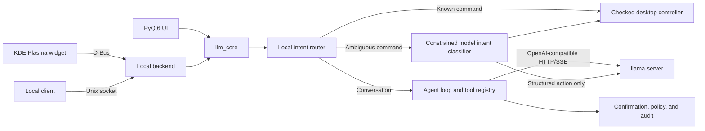

# LLM Assistant

[](https://github.com/silaslv/llm-assistant/actions/workflows/tests.yml)
[](https://www.python.org/)
[](https://kde.org/plasma-desktop/)

A local-first LLM desktop assistant for KDE Plasma and PyQt6, backed by an
OpenAI-compatible `llama-server` endpoint and a security-aware tool-calling loop.

## Why this project

The project explores how to turn probabilistic model output into controlled local
actions. Model access, agent orchestration, tools, confirmation policy, and audit
logging live in a shared Python core so different desktop clients follow the same
execution rules.

## Highlights

- Streaming chat through an OpenAI-compatible HTTP/SSE client
- Shared `llm_core` for the PyQt6 UI, local clients, and Plasma backend
- Deterministic local routing for common desktop commands, with constrained
  model-based intent recognition as a validated fallback
- Multi-turn tool calling with bounded iterations and explicit error handling
- Confirmation gates for shell commands, file writes, and reads outside allowed roots
- Sensitive-path protection, dangerous-command blocking, and redacted JSONL audit logs
- KDE Plasma 6 widget over D-Bus and a Unix-socket interface for local clients
- Optional voice input plus checked volume, brightness, media, and app controls
- Floating, chat, sidebar, mini, and auto-docking UI modes with conversation copying
- Unit tests covering the agent loop, desktop routing, voice protocol, tools,
  configuration, and security policy

## Architecture



## Repository layout

- `scripts/llm-assistant` - launches the PyQt6 UI with a lightweight default model profile
- `scripts/llm-assistant-qt.py` - floating desktop UI and system tray integration
- `scripts/llm-assistant-backend.py` - D-Bus and Unix-socket backend
- `scripts/llama-serve` - local model launcher and model-alias configuration
- `scripts/llm_core/` - client, agent loop, deterministic desktop controller,
  constrained intent classifier, tools, configuration, and security policy
- `plasmoids/llm-assistant/` - KDE Plasma 6 widget
- `scripts/tests/` - unit tests

Model files, llama.cpp sources, and compiled binaries are intentionally excluded.

## Requirements

The current setup targets Arch Linux with KDE Plasma 6. Runtime dependencies include:

- Python 3.10+
- PyQt6
- dbus-python and PyGObject for the Plasma backend
- fish, curl, lsof, pactl, and brightnessctl
- a llama.cpp build exposing an OpenAI-compatible server

The bundled `llama-serve` script expects binaries below `~/ai/llama.cpp-build/bin`
and GGUF models below `~/ai/models`. Adjust it for other layouts.

## Quick start

Start the floating assistant:

```bash
scripts/llm-assistant
```

The window starts immediately. Common desktop commands work without a running
chat model. For conversation and ambiguous-command recognition, use the UI's
model button or start a server explicitly:

```bash
scripts/llama-serve lfm28
```

The default assistant profile is `LFM2-8B-A1B-Q4_K_M` with an 8K context,
512 MiB server cache, full GPU offload, Q8 KV cache, Flash Attention, and mmap.
Larger reasoning and coding profiles remain available through `llama-serve`.

Install the Plasma widget:

```bash
scripts/install-plasmoid.sh
```

Configuration is read from `~/.config/llm-assistant/config.json`. Environment
variables such as `LLM_URL`, `LLM_PORT`, and `LLM_MODEL` can override model settings.

## Security model

- Dangerous command patterns are blocked.
- Arbitrary shell commands and file writes require explicit confirmation.
- Reads outside configured roots require confirmation.
- Sensitive paths and virtual/device trees such as `/proc`, `/sys`, and `/dev` are blocked.
- Audit logs redact written content and are stored with mode `0600`.

The assistant still executes commands with the current user's privileges. Review every
confirmation prompt and do not treat model output as trusted instructions.

## Tests

```bash
python -m pytest -q
```
